# aws-eb-cicd-laravel7 🐳


[](https://github.com/tquangdo/aws-eb-cicd-laravel7/issues/new)

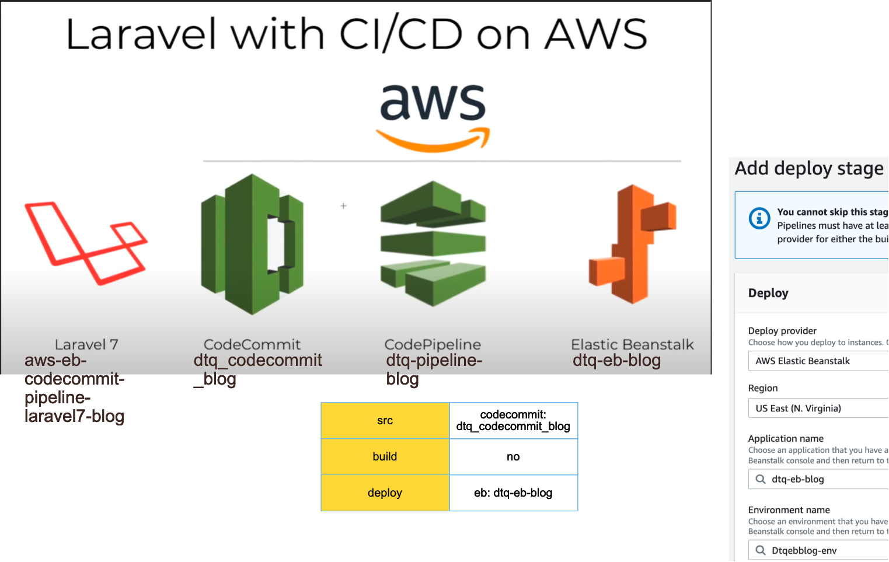
[cicd](https://docs.google.com/spreadsheets/d/1m8LuBQUzqIQ0bJYb3NJZOT4iSb78xUEG/edit#gid=1878281573&range=B10)

## reference
[youtube](https://www.youtube.com/watch?v=FdjOAJ6jrzE)

## create Laravel project
```shell
php -v -> PHP 8.0.14
composer -v -> Composer version 2.2.4
(Laravel7) composer create-project --prefer-dist laravel/laravel:^7.0 aws-eb-codecommit-pipeline-laravel7-blog
# composer create-project laravel/laravel aws-eb-codecommit-pipeline-laravel-blog
```
> ⚠️WARNING⚠️: if php & composer version are differenr, there will have this ERR: "During inheritance of ArrayAccess: Uncaught ErrorException:"
```shell
composer require laravel/ui
```
> + (Laravel7) if ERR:
> + `composer.json` add "laravel/ui": "*",
> + delete `composer.lock`
> + composer install
```shell
php artisan ui bootstrap --auth
npm i
npm run dev
php artisan serve
```
+ access `http://127.0.0.1:8000`

## codecommit
+ name=`dtq_codecommit_blog`
```shell
git init
git remote add origin ssh://git-codecommit.us-east-1.amazonaws.com/v1/repos/dtq_codecommit_blog
git add .
git commit -m '1st'
git push -u origin master # if ERR use `git push -f origin master`
```
+ connect SSH: https://docs.aws.amazon.com/console/codecommit/connect-ssh-unix_np
+ `.gitignore` > cmt out `# .env` > push again

## eb
+ name=`dtq-eb-blog`
+ choose platform `PHP8 Linux2` (nginx): MUST map with `composer.json > "php": "^7.x|^8.0",`
+ access eb's URL on browser
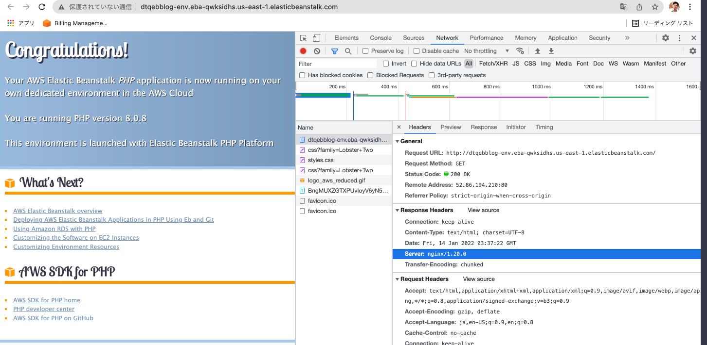
> if choose platform `Linux`
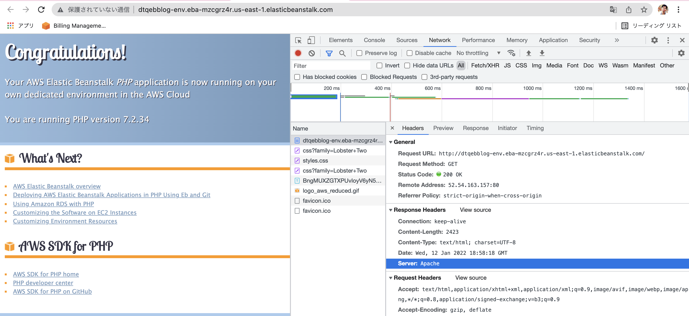

## codepipeline
+ name=`dtq-pipeline-blog`
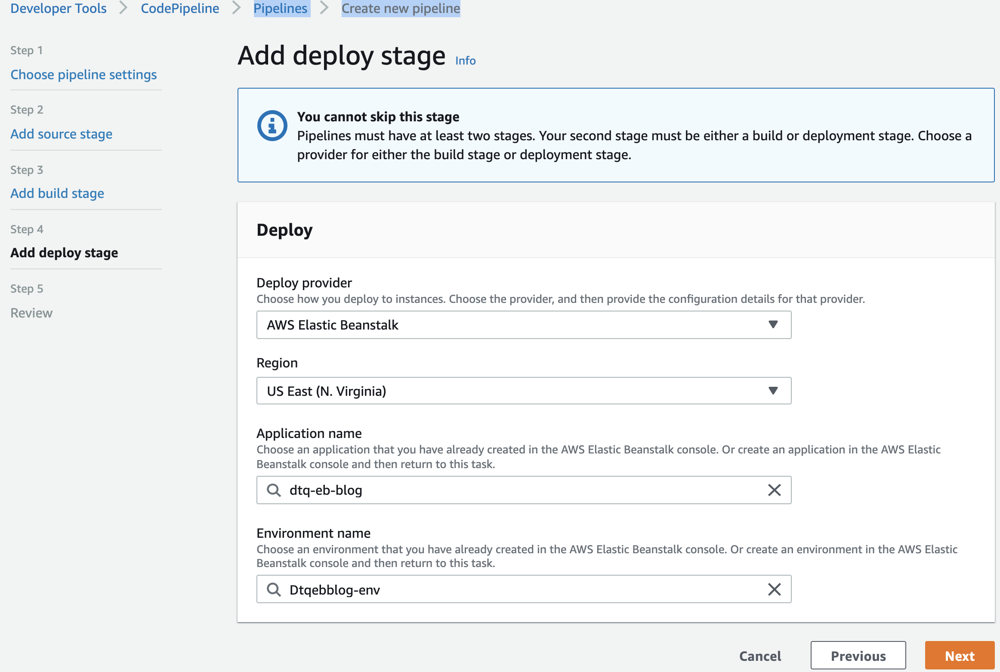
+ done
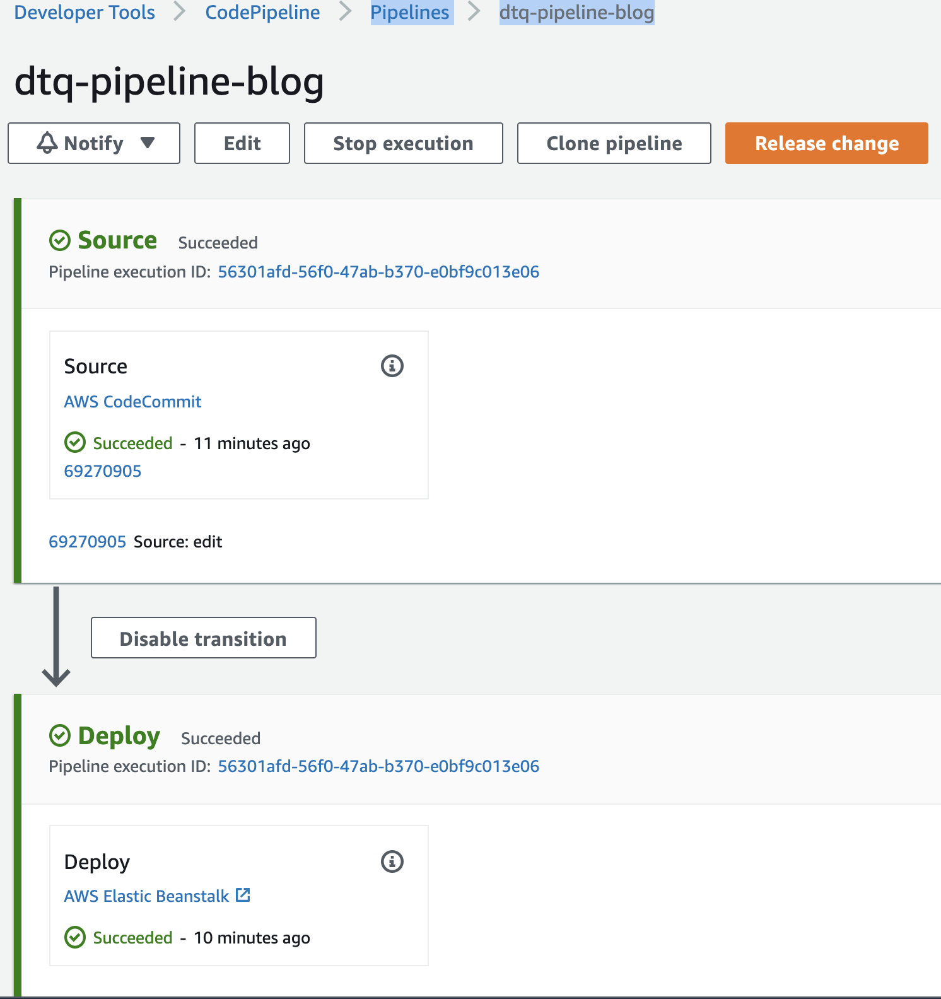

## eb
+ Configurations >
+ 1. edit `Software` > Document root=`/public`
+ 2. edit `DB` > `mysql` > username=`admin` + PW=`xxx`
+ edit `.env`
```shell
DB_CONNECTION=mysql
DB_HOST=aao2h0fnfjr39m.cxsssyzl7oed.us-east-1.rds.amazonaws.com
DB_PORT=3306
DB_DATABASE=ebdb
DB_USERNAME=admin
DB_PASSWORD=xxx
```
+ access eb's URL on browser
> ⚠️WARNING⚠️: (nginx) ERR -> create `.platform/nginx/nginx.conf`
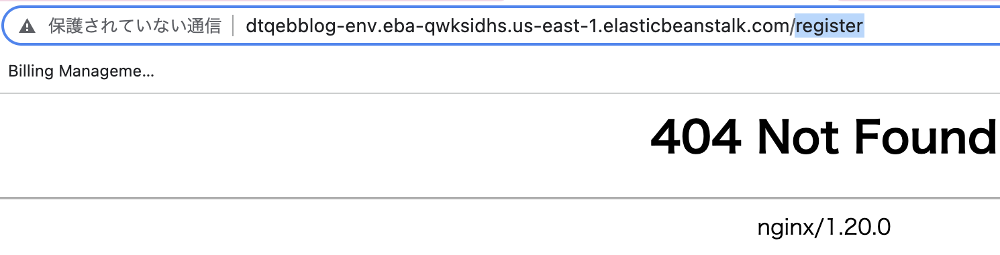
> ⚠️WARNING⚠️:  ERR migrate -> click `Run migrations`
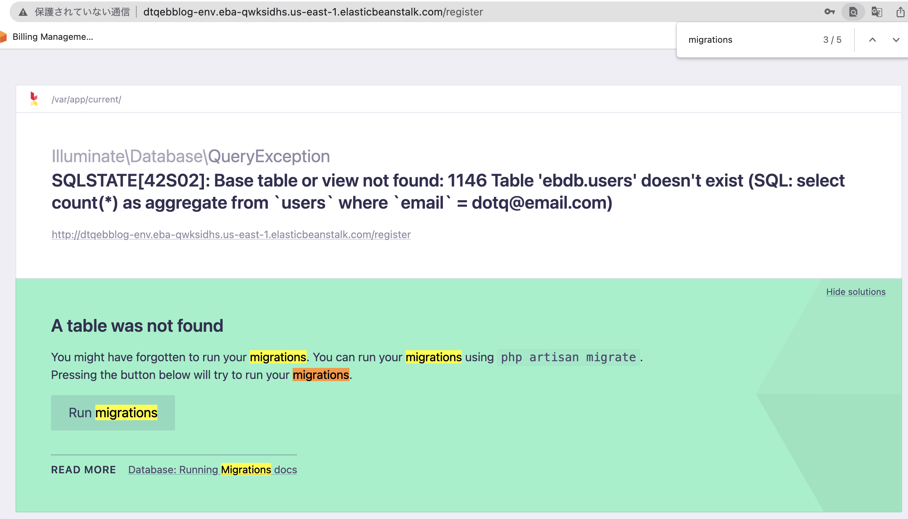

## connect db
+ add `MyIP` at `Inbound Rules`
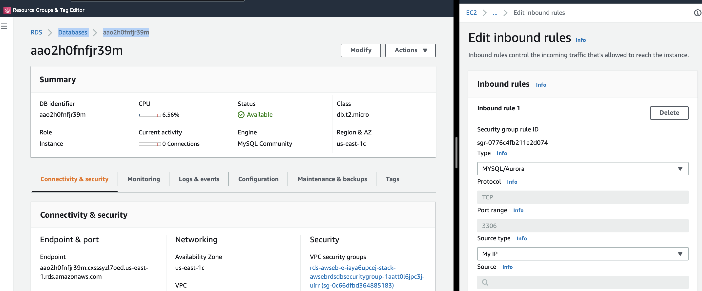
+ use Workbench
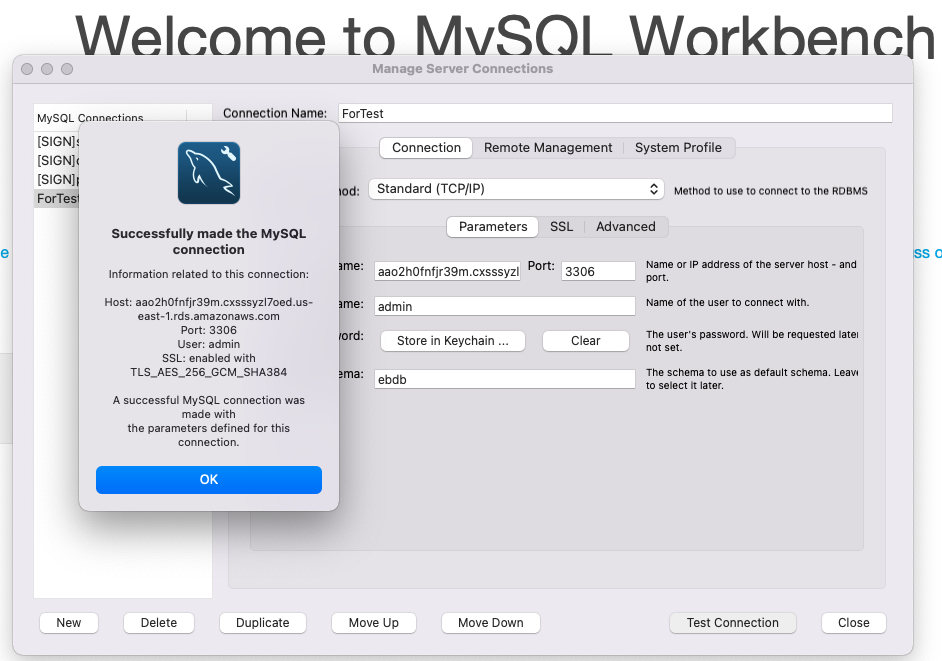
+
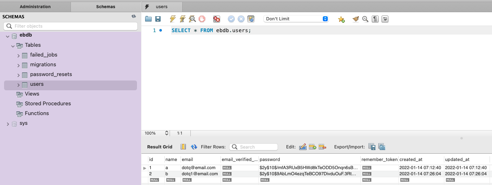

## final result
+ access eb's URL on browser > register > login > OK!
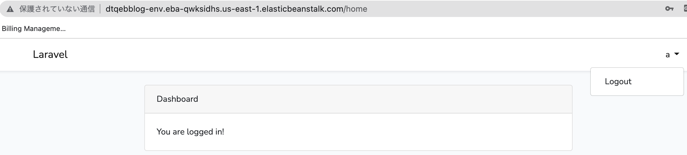

